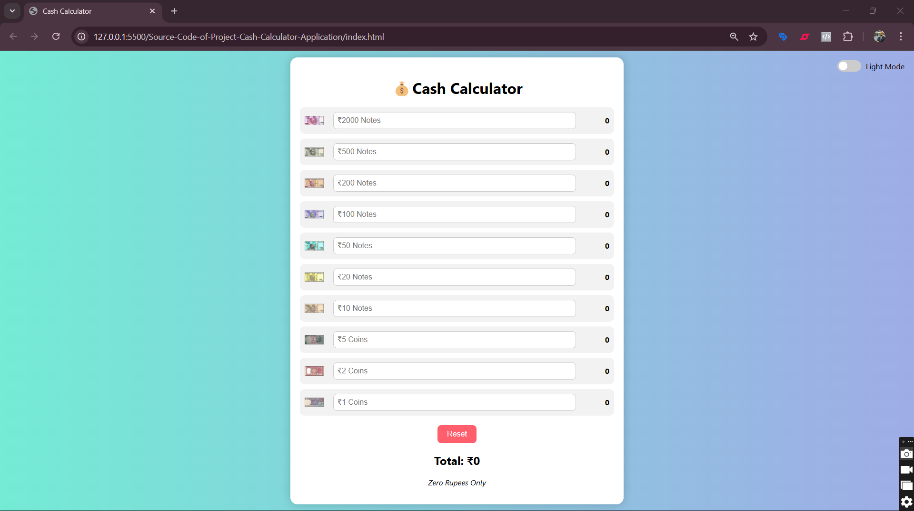

# 💰 Cash Calculator Web App

A modern, responsive, and user-friendly cash calculator web application designed to simplify currency counting by allowing users to input the quantity of each denomination. It provides real-time calculations and displays the total amount both in **numbers and words**.

---

## 🚀 Features

- 💵 Denomination-wise input from ₹2000 to ₹1
- 🔢 Real-time total calculation
- 🔤 Converts amount to words
- 🌗 Dark/Light mode toggle
- 💫 Beautiful glassmorphism UI with vibrant gradients
- 📱 Fully responsive across mobile, tablet, and desktop
- 🔁 Reset button to clear all fields instantly

---

## 🌐 Live Demo

👉 [Try it live here](https://skanthiwar.github.io/cash-calculator/)

---

## 📷 UI Preview

> Add a screenshot in the `/images/` folder and update the link below once uploaded:

---

## 🛠 Tech Stack

- **HTML5**
- **CSS3** (flexbox, gradients, animations, media queries)
- **JavaScript** (DOM, dynamic calculations, mode switching)

---

## 📱 Responsive Design

| Device      | Experience                              |
|-------------|------------------------------------------|
| 📱 Mobile    | Scrollable layout with easy inputs       |
| 🖥️ Desktop   | All content visible on-screen, no scroll |
| 📱 Tablet    | Optimized layout with responsive scaling |

---

## 📝 How to Use

1. Enter the quantity of each note denomination.
2. Instantly see the calculated total and its equivalent in words.
3. Toggle between Light/Dark mode for your preference.
4. Click the Reset button to clear all fields.

---

## 💡 Purpose

This project was built to improve the cash-counting experience using a visually appealing and intuitive interface. Ideal for individuals, shopkeepers, and cash handlers.

---

## 📌 Author

**Swapnil Kanthiwar**  
🔗 [LinkedIn](https://www.linkedin.com/in/swapnil-kanthiwar-648906176)

---

## ⭐ Show Your Support

If you found this helpful or impressive, don’t forget to:

- ⭐ Star the repo  
- 🔗 Share it with others  
- 💬 Drop feedback or suggestions

---

